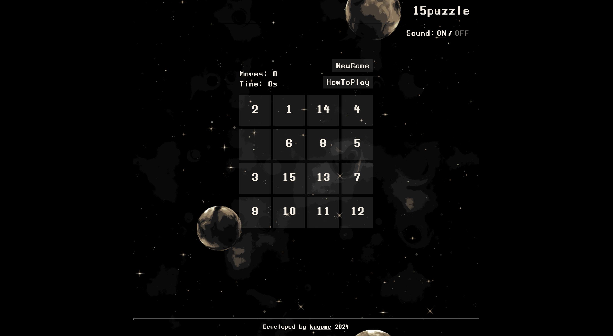

# 15puzzle

## 概要 (_Overview_)

15 パズルを作りました。  
8 パズル・24 パズルも作りたいのですが、もしかしたら実装しないかもしれません。  
ゲームをクリアすると、スコアを X（Twitter）で共有できます。  
また、宇宙の雰囲気が楽しめますので、良ければサウンドをオンにして遊んでみてください 🪐

_I created a 15 puzzle game._  
_I'm considering making 8-puzzle and 24-puzzle as well, but I might not implement them._  
_When you clear the game, you can share your score on Twitter._  
_Enjoy the cosmic atmosphere, so feel free to turn on the sound and give it a try!_

## 制作期間 (_Production Period_)

3 日間 (_3days_)

## 使用素材 (_Used Materials_)

- フォント (_font_)
  - https://www.1001fonts.com/manaspace-font.html
- 画像 (_images_)
  - https://deep-fold.itch.io/space-background-generator
  - https://deep-fold.itch.io/pixel-planet-generator
- 音源 (_sounds_)
  - https://gooseninja.itch.io/space-music-pack
  - https://coloralpha.itch.io/50-menu-interface-sfx
